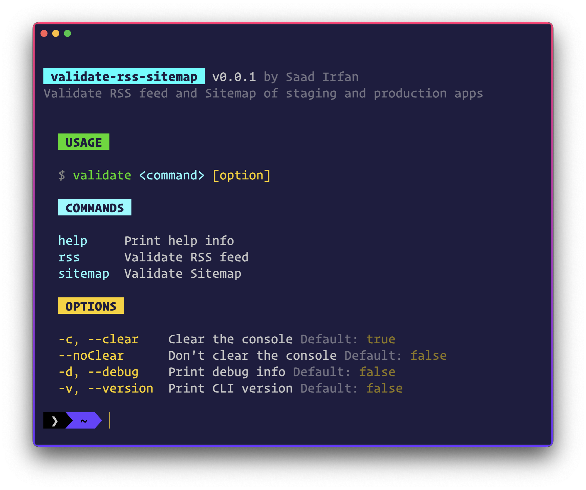

<div align="center">
	
	
	
	<a href="https://stars.github.com/nominate/">
		
	</a>
</div>
<br>

<p align="center">
<strong>Validate RSS feed and Sitemap of one app against other app</strong>
</p>


- **RSS Feed**: Quickly validate RSS feed inside your terminal
- **Sitemap**: Quickly validate Sitemap inside your terminal
- **Simple**: Just pass the URLs of both apps and it will validate the RSS feed and Sitemap of one app against other app.
- **Cross-Platform**: Works on Windows, Linux, and macOS
- **MIT License**: Free to use for personal and commercial projects

<br>


## Install

```sh
# install the CLI globally
npm i -g validate-rss-sitemap

# use it with npx (recommended)
npx validate-rss-sitemap
```

<br>


## Usage

```sh
# run the CLI
validate

# help
validate help

# validate RSS feed
validate rss

# validate Sitemap
validate sitemap
```



## 👨🏻‍💻 Contributing

Make sure you read the [contributing guidelines](https://github.com/msaaddev/validate-rss-sitemap/blob/main/contributing.md) before opening a PR.

## ⚡️ Other Projects

I have curated a [detailed list](https://github.com/msaaddev/open-source) of all the open-source projects I have authored. Do take out a moment and take a look.

## 🙌 Props

- [Nirmalya Ghosh](https://github.com/ghoshnirmalya) (Suggested the idea)

## 🔑 License & Conduct

-   MIT © [Saad Irfan](https://github.com/msaaddev)
-   [Code of Conduct](https://github.com/msaaddev/validate-rss-sitemap/blob/main/code-of-conduct.md)
